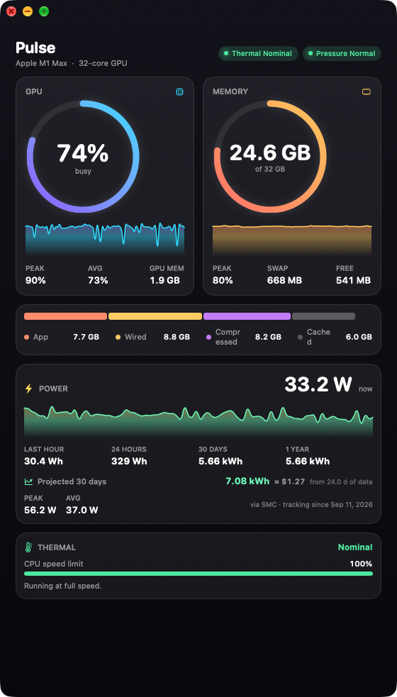
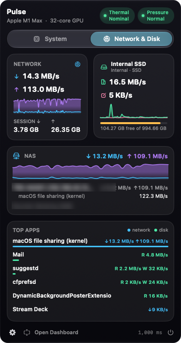

# Pulse — menu bar system monitor for macOS (Apple Silicon + Intel)

Native SwiftUI menu bar app. No Electron, ~0% CPU, updates itself.

<p align="center">
  
  &nbsp;
  
</p>

## Download

**[Download Pulse.dmg](https://github.com/troymeekhof/pulse/releases/latest/download/Pulse.dmg)** — macOS 13 Ventura or newer.

1. Open the DMG and drag **Pulse** into **Applications**, then open it.
2. First launch only: macOS will warn that it can't verify the app. Click **Done**, then go to
   **System Settings → Privacy & Security** and click **Open Anyway**.
3. Pulse lives in the menu bar (no Dock icon). It updates itself automatically from then on;
   gear menu → **Check for Updates…** checks right away.

## What it shows

**Menu bar widget** shows live `GPU % · Memory used`. Click it for the dashboard:
GPU ring + 90-second sparkline, memory ring + sparkline, App / Wired / Compressed / Cached
breakdown bar, swap, macOS memory-pressure state, and a thermal card (ProcessInfo thermal state + `pmset -g therm` CPU speed limit; the menu bar icon turns into a thermometer while throttling). "Open Dashboard" gives a larger
resizable window with renderer/tiler split and GPU-allocated memory.

## Build from source

```bash
cd Pulse
./build.sh --install
```

Requires Xcode Command Line Tools (`xcode-select --install` — the script prompts if missing).
Builds `Pulse.app`, copies it to `/Applications`, and launches it. Look for the waveform icon
in your menu bar.

## Power meter

Reads whole-system draw from the SMC (`PSTR`, same source as Stats/iStat; battery fallback), integrates it every tick into Wh, and persists minute/hour buckets to `~/Library/Application Support/Pulse/energy.json`. Totals shown for last hour, 24 h, 30 d, 1 y (auto Wh/kWh). Only counts while Pulse is running and the Mac is awake — turn on Launch at Login for full coverage. Includes a 30-day projection (average daily energy over the tracked window × 30, sleep counted as zero) with an estimated cost at the $/kWh rate set in the gear menu. Reset from the gear menu.

## Network, disk & NAS

Popover has a **System | Network & Disk** tab. Network: total ↓/↑ across real interfaces (getifaddrs), MB/s + Mbps, session totals. Disk: **one card per physical drive** (IOBlockStorageDriver statistics) — the internal SSD is always first; USB/Thunderbolt/SD drives get their own card when attached and disappear when ejected. Each shows read/write speed, sparkline, interconnect + SSD/HDD, and free space (volumes mapped to drives via the IORegistry, APFS-aware). **NAS card**: live traffic to SMB/AFP/NFS/DSM/Synology Drive ports, per NAS host, with which apps are generating it (from `nettop`), plus mounted shares. **Top Apps**: per-app network (nettop) and disk (proc_pid_rusage) speeds, sampled every 2 s. Reads from mounted shares are carried by the macOS kernel, so they show as "macOS file sharing (kernel)". Menu bar can show Network ↓↑ or Disk R/W.

## Settings (gear icon in the popover)

- Refresh rate: 0.5 / 1 / 2 / 5 s
- Menu bar shows: GPU + Memory, GPU only, Memory only, or icon only
- Launch at login

## How it reads the numbers

- **GPU** — IOKit `IOAccelerator` → `PerformanceStatistics` (`Device Utilization %`,
  `Renderer Utilization %`, `Tiler Utilization %`, `In use system memory`). Same source
  Activity Monitor's GPU History uses; no root required.
- **Memory** — Mach `host_statistics64` (App = internal − purgeable, Wired, Compressed,
  Cached = file-backed + purgeable) plus `vm.swapusage` and
  `kern.memorystatus_vm_pressure_level` via sysctl. "Used" matches Activity Monitor.

## Files

```
Package.swift                 Swift Package (macOS 13+, IOKit + ServiceManagement)
Sources/Pulse/PulseApp.swift  App entry, MenuBarExtra, dashboard window, launch-at-login
Sources/Pulse/Monitor.swift   Sampling engine + ring-buffer history
Sources/Pulse/Views/          Theme, Ring, Sparkline, StackedBar, DashboardView
Resources/Info.plist          LSUIElement (no Dock icon), bundle metadata
Resources/Pulse.icns          App icon (regenerate with make_icon.py)
build.sh                      Build + bundle + ad-hoc codesign (+ --install)
```
